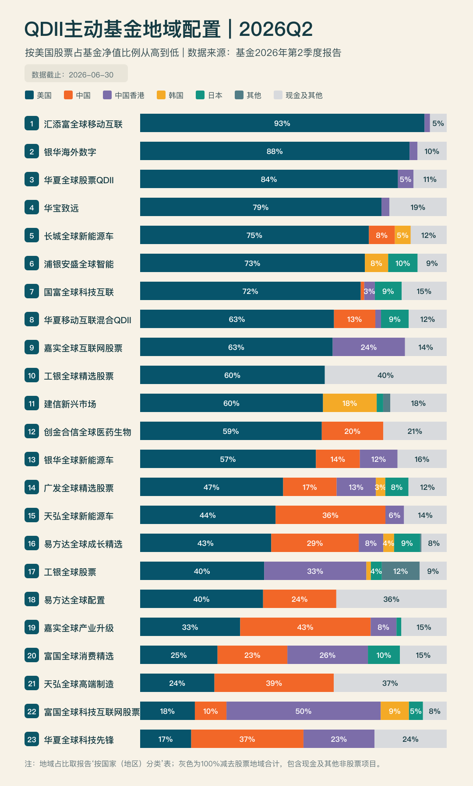

<div align="center">
  
  <h1>Fund Region Allocation</h1>
  <p><b>基金季报地域配置图</b></p>
  <a href="https://github.com/baizhi958216/fund-region-allocation/stargazers"></a>
  <a href="https://github.com/baizhi958216/fund-region-allocation/releases"></a>
  <a href="https://github.com/baizhi958216/fund-region-allocation/actions/workflows/generate-release.yml"></a>
  
</div>

## Why

QDII 季报十几页 PDF 的表格，手工查基金、统一国家口径、核对比例、重新排序再画图，重复又容易错。

Fund Region Allocation 把这套工作交给 AI：你只需要说出报告期和基金范围，Skill 自动寻找公开报告、提取地域配置，生成配置图片和证据数据。

所有数据来自基金定期报告。

## Showcase

真实生成结果，数据截止 `2026-06-30`。点击图片查看对应 Release。

<div align="center">
  <a href="https://github.com/baizhi958216/fund-region-allocation/releases/tag/2026Q2-r3">
    
  </a>
  <br>
  <sub>23 只 QDII 主动基金 · 2026Q2</sub>
</div>

## Install

把仓库安装到 Codex Skills 目录：

```bash
git clone https://github.com/baizhi958216/fund-region-allocation.git \
  ~/.codex/skills/fund-region-allocation
```

重新打开 Codex 任务即可。首次使用时，AI 会自动运行 `npm ci` 安装锁定依赖，用户不需要手动执行流水线。

更新 Skill：

```bash
git -C ~/.codex/skills/fund-region-allocation pull --ff-only
```

## Use

Skill 从自然语言请求触发，不需要记命令。可以直接说：

- `生成基金最新一期的地域配置总结图`
- `抓取 2026Q2 的基金地域配置`
- `把基金池换成下面这些代码，再输出 PNG、SVG 和 CSV`
- `核对这张地域配置图与基金季报是否一致`

也可以显式调用：

```text
使用 $fund-region-allocation 生成最新一期基金地域配置总结图，
同时给我 PNG、SVG、CSV 和来源证据。
```

AI 会自动完成：

1. 选择默认的基金共同可用的最新报告期，或使用用户指定季度。
2. 下载公开披露的季度报告并定位国家/地区配置表。
3. 统一地域口径，保留原始表格行、报告页码和 PDF 地址。
4. 校验明细合计、报告合计和最终图表是否一致。
5. 输出图片、结构化数据与证据文件。

## Output

| 文件 | 用途 |
| --- | --- |
| `fund-region-allocation-YYYYQn.png` | 社交媒体、公众号和快速预览 |
| `fund-region-allocation-YYYYQn.svg` | Figma、Illustrator 等工具继续编辑 |
| `fund-region-allocation-YYYYQn.csv` | 排名、基金代码和地域原始百分比 |
| `fund-region-allocation-YYYYQn-evidence.json` | 报告标题、发布日期、URL、页码和原始地区行 |

## Default Funds

默认基金池采用以下 23 只持有美股的 QDII 基金，每只基金只保留一个代表份额，避免 A/C 类和人民币/美元份额重复。

<table>
<tr><td>01 · 富国全球科技互联网股票</td><td>02 · 嘉实全球互联网股票</td></tr>
<tr><td>03 · 工银全球精选股票</td><td>04 · 华夏全球股票QDII</td></tr>
<tr><td>05 · 华夏全球科技先锋</td><td>06 · 汇添富全球移动互联</td></tr>
<tr><td>07 · 富国全球消费精选</td><td>08 · 华夏移动互联混合QDII</td></tr>
<tr><td>09 · 广发全球精选股票</td><td>10 · 工银全球股票</td></tr>
<tr><td>11 · 银华全球新能源车</td><td>12 · 创金合信全球医药生物</td></tr>
<tr><td>13 · 易方达全球成长精选</td><td>14 · 银华海外数字</td></tr>
<tr><td>15 · 华宝致远</td><td>16 · 长城全球新能源车</td></tr>
<tr><td>17 · 浦银安盛全球智能</td><td>18 · 国富全球科技互联</td></tr>
<tr><td>19 · 建信新兴市场</td><td>20 · 天弘全球新能源车</td></tr>
<tr><td>21 · 易方达全球配置</td><td>22 · 嘉实全球产业升级</td></tr>
<tr><td>23 · 天弘全球高端制造</td><td></td></tr>
</table>

完整代码与名称位于 [`assets/funds.json`](assets/funds.json)。需要其他基金时，把清单交给 AI 即可。

## Method

核心数据来自定期报告中的：

```text
报告期末在各个国家（地区）证券市场的股票及存托凭证投资分布
```

详细分类规则见 [`references/allocation-rules.md`](references/allocation-rules.md)，来源优先级见 [`references/source-priority.md`](references/source-priority.md)。

## Automation

每次推送 Tag，GitHub Actions 会为默认 23 只基金自动生成产物，并同时发布为 Actions Artifact 和 GitHub Release Assets。

```bash
git tag -s 2026Q3 -m "Generate 2026Q3 fund allocation"
git push origin 2026Q3
```

Tag 包含 `YYYYQn` 时生成指定季度；普通版本 Tag 会选择所有基金共同可用的最新季度。工作流已经过 [`2026Q2-r3`](https://github.com/baizhi958216/fund-region-allocation/actions/runs/30830659269) 实际验证。

## Design

暖米色画布承载信息，深青色代表美国配置，橙色代表中国，紫色代表中国香港；其余地区维持固定颜色。图表只在有足够空间时显示百分比，避免小区块标签互相覆盖。

SVG 是母版，PNG 由同一份 SVG 确定性渲染。数据与视觉彼此分离：改颜色不会改数字，换基金不会改变校验标准。

<details>
<summary><b>Development</b></summary>
<br>

普通 Skill 用户不需要运行以下命令。本地开发和调试时：

```bash
git clone https://github.com/baizhi958216/fund-region-allocation.git
cd fund-region-allocation
npm ci
npm test

node scripts/run-pipeline.mjs \
  --period 2026Q2 \
  --output-dir ./outputs \
  --reference-label
```

运行时要求 Node.js `20.16` 或更新版本。核心依赖锁定在 `package-lock.json`：PDF.js 负责 PDF 文本提取，Sharp 负责 SVG 到 PNG 的渲染。

</details>

## Support

如果这个 Skill 对你有用，可以点一个 Star；发现新基金报告格式无法解析时，请提交 Issue 并附上基金代码、报告期和公开报告链接。

本项目用于公开数据整理与可视化，不构成投资建议。
